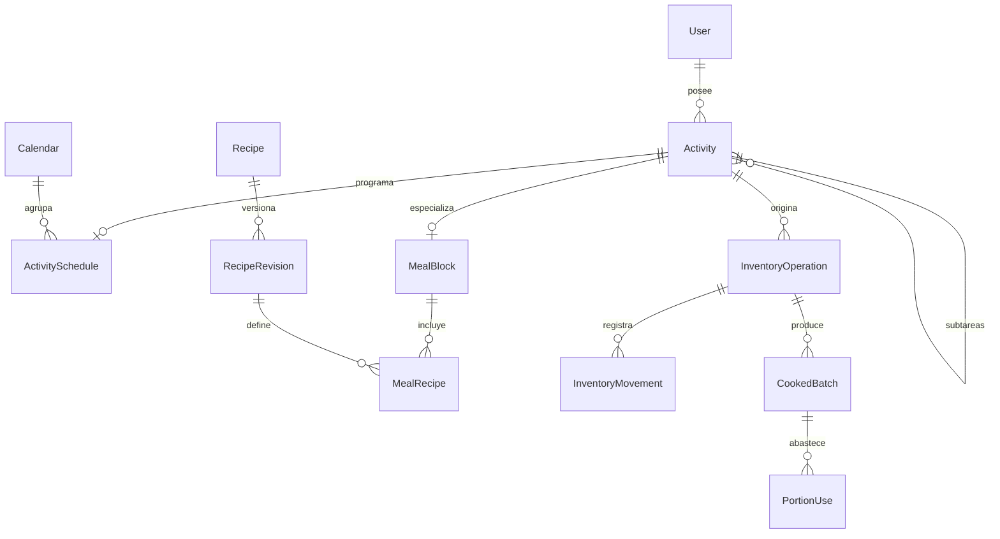

# Esquema físico: diseño inicial y registro histórico

Fecha de diseño inicial: 2026-10-03. Estado al 2026-10-06: el esquema instalado está en `reconstruction/core/schema.prisma`; las entradas de implementación de este documento son cronológicas y pueden describir etapas ya superadas. Consultar [arquitectura actual](ARQUITECTURA_ACTUAL.md) y [guía del núcleo](../reconstruction/core/README.md).

Fuentes: `PROJECT.md`, `MODELO_OBJETIVO.md` y la decisión adicional de compartir sobras entre revisiones de la misma receta. Artefacto inicial: `docs/schema.objetivo.prisma`. Es referencia de diseño; generar el cliente actual desde `reconstruction/core/schema.prisma`, nunca desde esta propuesta.

Implementación vigente: 34 modelos de dominio/autenticación en el núcleo propio `miagenda_core`, con migraciones incrementales de actividades, recurrencias y Cocina. El modo alternativo anterior se retiró. El registro siguiente conserva cómo se construyó por etapas; no es una lista vigente de funciones pendientes.

Control de mantenimiento añadido el 2026-10-05: `User.retentionCheckedAt` y `User.retentionSegmentCursor` permiten ejecutar/continuar tandas de retención sin sondeo. Son metadata operativa, no estados editables de actividades. Índice por última ronda/usuario y un índice parcial de candidatos completados en Activity. Retención del núcleo implementada en `reconstruction/core/src/retention.ts`; las reglas especializadas de Cocina siguen pendientes.

Primer bloque de Cocina aplicado el 2026-10-05: Ingredient/Preference, PantryBalance y InventoryOperation/Movement. El catálogo global contiene 41 ingredientes depurados; saldos iniciales vacíos. Nombres activos globales y privados tienen índices únicos parciales. Revision en ingrediente/preferencia/saldo protege ediciones simultáneas. Movimientos/operaciones son inmutables; el trigger de movimiento aplica el delta y una restricción diferida exige saldo = suma de movimientos del mismo usuario/ingrediente. Triggers validan acceso a ingredientes privados y unidad; esta no cambia tras movimientos o existencias. Solo ajustes están habilitados inicialmente. Quitar de Alacena registra ajuste a cero y `listed=false`; ocultar sugerencia es una preferencia personal independiente del stock. La retirada/sustitución de referencias de recetas/compras se adapta al reconstruir esos módulos.

## 1. Resultado de la revisión

Planificación propia instalada el 2026-10-05: MealSlot con revisión, MealBlock como extensión 1:1 de Activity meal, MealCell como reclamo único de fila/fecha, MealRecipe congelada a RecipeRevision y MealStepData por hijo/receta/paso/rol. `kitchenInitialized` evita recrear filas eliminadas. Constraint diferida exige horario con hora en Cocina, fecha local coherente con celda y al menos una receta lista por comida activa. Se retira el gate task-only, sustituyéndolo por comida principal pendiente sin recurrencia hasta consumos. Pasos de cocina no completables aún; previos independientes. Traslado de fila no cambia horas existentes; versiones de comidas no se actualizan automáticamente. Unidad/cantidad por paso congeladas. El esquema conserva el protocolo común de propietario y recibos, sin nuevos servicios externos.

Recetario del núcleo aplicado el 2026-10-05: Recipe/RecipeRevision/RecipeStep. Revisiones y pasos inmutables; retirar marca Recipe.retiredAt y conserva versiones. Draft permite porciones/tiempo nulos y cero pasos, pero exige nombre. Una revisión lista exige porciones/tiempo positivos y al menos un paso mediante constraint diferida. Optional es del paso, incluso sin ingrediente. Las contribuciones se agrupan por ingrediente y opcionalidad sin duplicar su entrada. Se captura nombre/unidad y clave estable del paso; referencias a ingrediente privado autorizadas por usuario. La unidad canónica queda protegida también después de una referencia de receta. Crear ingredientes desde el editor delega en PantryService. Ninguna edición del recetario crea Activities ni movimientos de stock. La conexión a comidas sigue pendiente.

El esquema organiza las acciones alrededor de **una sola Activity** y distingue programación, definición recurrente y datos especializados. No tiene tablas InboxItem, EventOverlay, GoogleCalendarLink ni ScheduledSubtask.

La propuesta permite:

- Pasar una tarea Inbox → Agenda → Inbox conservando identidad/progreso.
- Programar un hijo cuyo padre no está programado, con claves de propietario en sus relaciones.
- Compartir tareas y comidas entre vistas, con extensiones de Cocina y un nivel máximo de subtareas.
- Conservar versiones de recetas en los planes, y usar sobras entre versiones de la misma identidad de receta.
- Registrar compras/consumos y revertirlos sin depender de conservar toda la tarjeta de agenda.
- Calcular futuras repeticiones sin almacenarlas todas; persistir excepciones y progreso cuando se necesiten.

**Importante:** Prisma valida la estructura y las relaciones. Varias reglas del producto requieren SQL complementario y servicios transaccionales, definidos en la sección 6. Validación de Prisma no demuestra que esas reglas ya estén implementadas.

## 2. Convenciones de almacenamiento

| Elemento | Elección |
|---|---|
| IDs de entidades | UUID, generables por servidor o cliente; no usar IDs Google para actividades |
| Propietario | `userId` UUID; relaciones privadas compuestas con propietario |
| Instantes | PostgreSQL `timestamptz(3)`; cálculo de calendario usando zona IANA |
| Fechas sin hora | PostgreSQL `date`, fin exclusivo para todo el día |
| Cantidades de stock/movimientos | `numeric(12,3)`, nunca Float |
| Porciones | `numeric(10,3)`, permite fracciones sin cambiar identidad de receta |
| Cantidad intermedia por porción | `numeric(18,9)`; redondear cantidad final agrupada a 3 decimales |
| Unidades canónicas | g, ml, piece; kg/l se convierten al entrar y pueden mostrarse al presentar |
| Concurrencia | `revision` en entidades editables; `dataRevision` por usuario para invalidación |
| Orden de marcas | `progressSequence` y secuencia del comando; no usar nombre ni solo hora de reloj |
| JSON | Solo respuesta de comando y payloads acotados futuros; relaciones/estado en tablas |

Los BigInt se serializan como strings en la API; Prisma devuelve Decimal y la API transmite cantidades como strings. Convertirlos a Number sin control destruiría parte de las garantías de precisión.

La división de ingredientes se realiza con decimal de suficiente precisión. Ejemplo: 1 g para 3 porciones no se guarda como 0,333 g y vuelve a multiplicarse a 0,999 g sin compensación. Escalar desde la cantidad base, agregar por ingrediente y redondear una vez en el límite del movimiento. Los snapshots intermedios son una ayuda, no un motivo para truncar temprano.

`@@unique([id,userId])` puede ser redundante respecto al ID desde la perspectiva lógica, pero es necesario para referenciar ambos campos en claves foráneas. Se acepta ese índice por la garantía de propietario; no se crean índices secundarios sin consulta concreta.

## 3. Tablas por responsabilidad

### 3.1 Acceso y núcleo

| Tabla/modelo | Rol y unicidad |
|---|---|
| User | Cuenta interna y preferencias; revisión de datos |
| Account | Proveedor/sujeto únicos; Google únicamente acceso |
| Session | Sesión de MiAgenda, token único y vencimiento |
| VerificationToken | Compatibilidad de adaptador; sin flujo de correo habilitado inicialmente |
| Calendar | Capa propia, módulo opcional; una capa por módulo/usuario |
| CalendarPreference | Visibilidad/orden de la capa del usuario |
| Activity | Estado común; padre del mismo usuario; vínculo opcional a una ocurrencia |
| ActivitySchedule | Una programación por actividad y calendario del mismo propietario |
| CommandReceipt | Una respuesta confirmada por usuario/commandId |

Account conserva la forma compatible con el adaptador, pero el adaptador descarta los valores de access/refresh/id tokens antes de persistir y SQL exige null para esas columnas. Se conservan proveedor, sujeto y metadata mínima. No se pide permiso Calendar ni acceso offline a sus APIs. La sesión de MiAgenda no requiere renovar un token de Calendar.

Inbox es una consulta de principales task activas sin Schedule. Día/Agenda son consultas de Schedule y recurrencia resuelta. Un módulo no crea otra tabla de tarea principal.

La relación de origen desde Activity es opcional en la evidencia real cuando se retira el detalle; la evidencia mantiene su clave mínima.

### 3.2 Recurrencia

| Tabla/modelo | Rol |
|---|---|
| RecurrenceSeries | Familia permanente, revisión y retirada de generación |
| SeriesSegment | Contenido/regla efectiva entre ordinales; calendario, ancla local, zona y duración |
| SeriesStepKey | Identidad estable de un paso en la familia |
| SeriesStepDefinition | Contenido/orden de ese paso en un segmento |
| OccurrenceOverride | Ocurrencia tocada o retirada; ordinal único dentro de familia |
| SeriesProgressRule | Instrucción de marca/desmarca de principal o paso por rango |
| OccurrenceRetirementRange | Exclusión compacta de ordinales contiguos ya retirados |

La identidad persistida de una repetición es familia + ordinal lógico (desde cero). El ordinal no cambia al mover la instancia; `originalLocal` conserva el origen de la materialización. Un segmento usa límites `[fromOrdinal,toOrdinal)` y un ancla local. Cambiar frecuencia modifica la expansión desde el punto elegido, manteniendo la familia y las excepciones por ordinal, no por título o timestamp nuevo.

Implementación de frecuencia (2026-10-05): cada nueva regla usa un namespace de ordinales separado mediante `SeriesSegment.ordinalOffset` (bloques de 4 000 001). Los ordinales anteriores y sus IDs no se reasignan. `protectedOnly/protectedRanges` congelan los intervalos con progreso de generaciones sustituidas, sin materializar el futuro. Las instancias físicas se conservan; sus fechas originales suprimen duplicados en las generaciones nuevas. Los alcances se calculan por fecha original, independientemente del namespace y de movimientos posteriores. Las instrucciones de progreso se limitan por tramo/generación para que las nuevas fechas empiecen pendientes. Las exclusiones anteriores también se consultan por su fecha original; nunca se resucita una fecha eliminada o purgada al cambiar una regla. La retención respeta offsets e intervalos protegidos.

Antes de un cambio de frecuencia con excepciones futuras, el servicio calcula el plan resultante y valida qué ocurrencias mantienen sus cambios y qué efecto tiene el alcance elegido. No descartar ni reasignar excepciones por coincidencias aproximadas. Los cambios de alcance total/siguientes aplican también a las materializadas cuando el usuario así lo indica; conservar pertenencia no significa ignorar ese alcance.

Para conservar ID entre representación virtual y persistida, resolver un UUID determinista desde familia/ordinal y, para hijos, desde padre/clave de paso. Al materializar se usa ese mismo ID; una consulta no lo inserta. La biblioteca concreta de UUID/recurrencia se elige al implementar, sin escribir un parser de calendario casero.

Una marca directa obtiene una secuencia de mutación del usuario y la guarda como `progressSequence`. Una marca de alcance guarda esa misma secuencia en su instrucción y actualiza las instancias persistidas afectadas. La instrucción efectiva más reciente resuelve progreso para futuras instancias; nunca reemplazar una marca posterior por una instrucción anterior. Para principal normal, la operación por alcance incluye la regla de completar/deshacer sus pasos según el contrato aprobado.

Retiradas compactadas y excepciones explícitas se consultan antes de devolver una repetición. No usar un corte de ocho meses para olvidar pendientes viejas. Paginación limita respuestas, no elimina lógicamente las pendientes.

### 3.3 Cocina e inventario

| Tabla/modelo | Rol |
|---|---|
| Ingredient / IngredientPreference | Catálogo global/privado y retiro/sustitución por usuario |
| PantryBalance | Saldo y revisión por usuario/ingrediente; `listed` controla presencia en alacena |
| Recipe / RecipeRevision / RecipeStep | Identidad y versiones inmutables con pasos/ingredientes |
| MealSlot | Fila personal, orden y minuto predeterminado del día |
| MealBlock | Extensión uno a uno de Activity meal, fases y tiempos |
| MealCell | Ocupación activa de una celda; única por fila/fecha |
| MealRecipe | Receta/version dentro del bloque y porciones separadas |
| MealStepData | Metadata de un hijo: origen, opcionalidad, ingrediente y función |
| InventoryOperation | Evidencia mínima de una acción real, ligada opcionalmente a su actividad |
| InventoryMovement | Delta exacto por ingrediente dentro de la operación |
| CookedBatch | Tanda, versión realmente cocinada y origen operativo |
| PortionUse | Consumo real de una tanda por una operación/receta del bloque |

MealCell evita intentar un índice parcial que consulte otra tabla para saber si el bloque está activo. Su fila existe mientras el bloque ocupa la celda; retirar el plan libera la celda y no elimina consumos reales. Un bloque creado desde Agenda puede recibir celda al elegir su fila; antes de clasificarlo sigue existiendo como comida programada. No crear dos bloques en una celda.

Recipe guarda identidad; su versión vigente es la de mayor número. Una edición crea revisión y pasos nuevos. El plan mantiene su revisión hasta actualización explícita. Retirar del recetario oculta la identidad pero no borra versiones referenciadas.

Tandas se relacionan con RecipeRevision para saber qué se cocinó. La proyección agrupa por `recipeRevision.recipeId` y admite todas sus versiones, según lo confirmado por el usuario. No comparar únicamente recipeRevisionId ni dejar de reconocer sobras cuando se retira una receta.

MealStepData conserva ingredientes/cantidades necesarias para personalizaciones de la instancia. La Activity hija es la única fuente de su marca; no hay booleano de progreso duplicado en metadata. Preparación previa no participa de consumir ni del completado automático del bloque.

### 3.4 Compras

Implementado el 2026-10-05 en `miagenda_core`: `ShoppingEntry` conserva entradas libres y ajustes de cantidades calculadas; `ShoppingReceipt` registra cada artículo realmente comprado con una operación individual de inventario. El grupo de compra usa el `commandId` compartido y el recibo idempotente `CommandReceipt`, sin una tabla adicional de cabecera. Estas son las representaciones físicas de las responsabilidades lógicas PurchaseReceipt/PurchaseLine descritas abajo. Comprar todos es una transacción; deshacer sigue siendo individual.

La necesidad se calcula solo desde bloques activos pendientes con Cocinar habilitado y celda vigente, de todas las semanas, usando sus revisiones congeladas. Los recibos guardan cantidad real y desglose necesario obligatorio/opcional; su visualización se limita a 30 días y se pagina por fecha/ID. Triggers exigen compras positivas, movimiento exacto para ingredientes (ninguno para texto libre), reversión exacta y unidades fijas tras referencias de compras. El saldo sigue derivado de movimientos inmutables. Las entradas/recibos se retiran o revierten, no se eliminan por cascada de Agenda.

| Tabla/modelo | Rol |
|---|---|
| ShoppingEntry | Artículo pendiente/manual y cantidad elegida opcional |
| PurchaseReceipt | Grupo de compra por comando |
| PurchaseLine | Cantidad realmente comprada y operación individual reversible |

ShoppingNeed **no es una tabla autoritativa**: se calcula desde planes, ingredientes, porciones e inventario. Así no se queda desfasada por copiar una semana. El endpoint puede entregar necesidad, aportes obligatorios/opcionales y cantidad elegida con una revisión del usuario.

Solo persistir ShoppingEntry planned cuando se necesite identidad de edición/acción. La necesidad nueva puede mostrarse de forma calculada hasta entonces. Cada fila planned activa por ingrediente/usuario es única mediante índice parcial SQL. Artículos manuales pueden repetirse intencionadamente y se distinguen por ID.

Comprar todos crea un recibo con varias líneas dentro de una transacción y una operación de compra por línea. Deshacer una línea revierte esa operación, no todo el recibo. Una línea libre no alimentaria tiene operación/recibo pero ningún movimiento de stock alimentario.

No agregar tablas de precios, paquetes, presupuesto o finanzas en este bloque. PurchaseLine es el punto de extensión posterior para costo real, sin alterar cantidades consumidas ni el horario.

## 4. Evidencia real y borrado

### Dos referencias diferentes

`sourceActivityId` enlaza al detalle mientras existe. `sourceKey` es un identificador de origen mínimo sin FK a una tarjeta que pueda desaparecer. Lo genera el servicio desde una entidad autorizada, nunca aceptando un origen arbitrario del cliente.

Igual para originMealRecipeId/consumerMealRecipeId frente a sourceItemKey/consumerItemKey. Antes de eliminar detalles, el servicio pone a null únicamente la referencia navegable, manteniendo usuario, clave de origen, cantidades y operación.

Se usa NoAction en claves compuestas opcionales, no SetNull automático: SetNull puede intentar poner a null también el userId no nullable. La documentación de [acciones referenciales de Prisma](https://www.prisma.io/docs/orm/v7/prisma-schema/data-model/relations/referential-actions) explica esa limitación. NoAction no equivale a una FK diferible por sí sola: la migración debe declarar DEFERRABLE expresamente si requiere comprobar al commit.

### Reversión sin doble contabilidad

- InventoryOperation reversal referencia de forma única la operación original. No hay dos reversiones válidas del mismo original.
- Sus movimientos son los deltas inversos exactos, no un cálculo nuevo desde la receta actual.
- Una tanda cuyo origen está revertido deja de aportar disponibilidad.
- Un uso cuyo consumidor está revertido deja de restar porciones. Conservar filas originales evita perder trazabilidad; no sumar sus cantidades como activas tras revertir.
- Antes de revertir una cocinada, bloquear si usos posteriores no revertidos dependen de su tanda. Usos de la misma operación se revierten con ella.
- Completar de nuevo crea otra operación/tanda; jamás reactiva una tanda que ya pertenece a un original revertido.
- Activity.completedAt es la autoridad de estado visible. InventoryOperation no es otra columna editable de «completado».

Un borrar calendario/comida confirmado retira detalle sin ejecutar reversión. Calendar tiene FK NoAction desde horarios/segmentos: un DELETE directo no borra actividades. La operación traslada o retira el conjunto, comprueba hijos en otras capas y trata reglas/excepciones, después elimina la capa común. Cocina mantiene su capa requerida.

### Compactación

Los detalles se purgan según cinco días/fin/Conservar y protección de hijos. CookedBatch/PortionUse/movimientos se compactan solo cuando dejan de sostener disponibilidad, dependencias y reversibilidad o la política de recibos. La compactación mantiene saldos correctos y no usa cascadas desde una actividad.

Plazos de recibos, métricas y cola offline siguen siendo decisiones posteriores. No activar una purga de esas evidencias con un plazo inventado. La propuesta no crea un historial permanente de todos los textos/pasos de usuario.

## 5. Consultas y concurrencia previstas

| Consulta | Índices/estrategia |
|---|---|
| Inbox | Activity usuario/lifecycle; principales sin Schedule, índice de padre; paginar |
| Agenda con hora | Schedule usuario/calendario/startsAt; filtrar también endsAt para intersección de rango |
| Todo el día | Schedule usuario/calendario/startDate; fin exclusivo y filtro de intersección |
| Año destacados | Activity usuario/highlighted + horarios de rango; recurrencias con excepciones |
| Semana Cocina | MealCell usuario/planningDate + joins de bloques/recetas/pasos |
| Disponibilidad | Todos los planes pendientes relevantes en una lectura consistente; tandas activas de recetas implicadas |
| Serie | Segmentos por serie/fromOrdinal; excepciones por serie/ordinal y claves de paso |
| Purga | Schedule purgeEligibleAt y Activity completedAt; comprobar keep/hijos al ejecutar |
| Comprados | PurchaseReceipt usuario/purchasedAt + líneas y estado de reversión |

El índice por inicio no excluye eventos que comienzan antes del rango y terminan dentro. El filtro de solapamiento debe ser `inicio < finRango AND fin > inicioRango`; evaluar índices adicionales solo con mediciones, no uno por cada posibilidad.

Leer Agenda no sincroniza Google. Calcular compras no reescribe todas las filas pendientes. Reservas de stock y sobras se derivan de una proyección cronológica única; no se almacenan como movimientos hasta completar.

Para pocos usuarios propongo una transacción corta y bloqueo consultivo por usuario en **todos** los comandos de stock/planes/series que comparten proyección. No mantenerlo durante red/OAuth. Los lectores usan snapshot consistente cuando combinan varias consultas. La edición absoluta exige revisión esperada; adquirir bloqueo no hace actual un formulario viejo.

Actualizar dataRevision dentro del mismo comando de negocio. Las lecturas no escriben revisiones. Default de preferencias/filas se inicializa en creación del usuario, no en cada GET.

## 6. Restricciones que la migración debe añadir

Este catálogo es parte del diseño físico. No se presenta el archivo Prisma como migración de producción completa. Las restricciones SQL y triggers se generarán/revisarán al preparar la base aislada; nunca se aplican a la actual por este documento.

### 6.1 CHECK e índices parciales de una sola tabla

| Tabla | Restricción SQL prevista |
|---|---|
| Account | provider = 'google'; refresh/access/id token IS NULL |
| Activity | título no vacío; position/revision/progressSequence >= 0; parentId distinto de id |
| ActivitySchedule | timed requiere startsAt/endsAt y fechas date null; allDay exige date y timestamps null; final posterior |
| SeriesSegment | ordinal inicial >= 0; final null o mayor; duración según mode; ancla/RRULE válidas en servicio |
| OccurrenceOverride | ordinal >= 0; reason y retiredAt coherentes |
| SeriesProgressRule | rango válido, sequence >= 0; stepKey null significa principal |
| OccurrenceRetirementRange | rango finito no vacío; merge contiguos en compactación |
| Ingredient | global sin owner; private con owner; nombre normalizado no vacío |
| Ingredient | UNIQUE normalizedName WHERE scope global AND retiredAt null; UNIQUE ownerUserId/normalizedName WHERE private AND retiredAt null |
| IngredientPreference | replacementId distinto de ingredientId |
| PantryBalance | quantity >= 0; revisión >= 0 |
| RecipeRevision | version > 0; nombre no vacío; porciones/tiempo positivos si existen; revisión lista requiere ambos y al menos un paso |
| RecipeStep | ingrediente/cantidad/unidad/nombre snapshot presentes juntos o ausentes juntos; cantidad > 0; anticipación > 0 con título previo; optional también sin ingrediente |
| MealSlot | startMinute entre 0 y 1439; position >= 0 |
| MealBlock | al menos una fase activa; minutos no negativos; overrides positivos si existen |
| MealRecipe | porciones no negativas, al menos una mayor que 0; override positivo |
| MealStepData | snapshots coherentes; quantityPerServing >= 0; priorReminder no consume ingredientes |
| InventoryOperation | reversalOfId requerido solo para kind reversal; no autorreferencia; sourceRevision no negativo si existe |
| InventoryMovement | delta != 0; unidad válida; unique operation/ingrediente |
| CookedBatch / PortionUse | servings > 0 |
| ShoppingEntry | desiredQuantity positiva si existe; manual exige cantidad; planned exige ingrediente |
| ShoppingEntry | UNIQUE userId/ingredientId WHERE kind planned AND retiredAt null |
| PurchaseLine | cantidad > 0; snapshots no vacíos |

CHECK no debe consultar otras filas para comprobar reglas cruzadas; las [restricciones PostgreSQL](https://www.postgresql.org/docs/current/ddl-constraints.html) distinguen ese caso de claves/constraints entre registros.

### 6.2 Reglas cruzadas: FK + triggers de integridad

| Regla | Protección requerida |
|---|---|
| Propietario inmutable e igual en relaciones | FKs compuestas y trigger para cambios de propietario/IDs |
| Activity.kind fijo | Trigger de inmutabilidad después de insertar |
| Un nivel de subtareas | Trigger comprueba padre raíz y que un nuevo hijo no tenga hijos; cambios concurrentes serializados por propietario |
| meal solo principal, extensión y horario obligatorios | Constraint trigger diferible al commit sobre Activity, MealBlock y Schedule |
| Conservar/Destacar requieren programación | Constraint trigger diferible sobre Activity y Schedule; highlighted no implica keep permanente, ambos pueden desactivarse independientemente |
| MealStepData hijo del bloque de su MealRecipe | FK de propietario y trigger valida parentId = blockId, kind task y fuente correcta |
| SeriesStepDefinition pertenece a familia del segmento | Trigger valida la familia, no solo el usuario |
| Activity de una serie usa paso de la familia de su padre | Trigger sobre Activity y SeriesStepKey |
| Segmentos de una familia no se solapan | Exclusión de rangos en SQL o constraint trigger con bloqueo por familia; revisar soporte antes de elegir implementación |
| MealCell solo bloque activo y fecha del horario en su zona | Trigger/servicio; unique slot/fecha ya garantiza ocupación exclusiva |
| Ingrediente privado no se usa por otro usuario | Triggers de acceso al ingrediente en saldo, pasos, movimientos, preferencias y compras; administrador controla global |
| Unidad de ingrediente no cambia con saldo/referencias | Trigger bloquea cambio; conversión mediante operación diseñada, no rename de enum |
| Receta y pasos de revisión inmutables | Triggers bloquean UPDATE; versiones nuevas se insertan en una transacción; limpieza solo cuando no están referenciadas |
| Recibo y línea apuntan a operación purchase | Trigger valida clase y mismo propietario |
| Batch origen mealCompletion; Use consumidor mealCompletion | Trigger valida clase y dueño; receta/tanda coherentes |
| Reversión apunta a original compatible, no a otra reversión | FK única + trigger; verificar op original y unidades/deltas inversos |

Prisma genera claves e índices declarados. CHECK/triggers/índices parciales y declaraciones DEFERRABLE son SQL complementario versionado. No dejar únicamente comentarios en código como garantía de estas reglas.

### 6.3 Reglas del servicio transaccional

- Completar normal afecta hijos; deshacer/reabrir respeta reglas de principal. No poner un trigger genérico de completado que ignore cocina.
- Completar comida reúne pasos usados y porciones, valida saldo y disponibilidad, crea operación/movimientos/tandas/usos y estado común; todo o nada.
- Elegir opcionales se registra por identidad de paso/receta, no solo ingrediente: un mismo ingrediente puede ser obligatorio y opcional en distintas contribuciones. La UI puede agruparlo mostrando esas contribuciones.
- Cambiar consumo/pasos de comida completada exige deshacer antes, salvo editar recordatorio previo sin modificar consumo. No descontar un opcional tardío silenciosamente.
- Una operación con el mismo commandId/payload devuelve el recibo previo; payload diferente con misma clave se rechaza. Commit de recibo y efecto es único.
- Las sumas de usos activos no exceden porciones de una tanda. Bloquear/validar en transacción; un CHECK local sobre una fila no garantiza esa suma.
- Ningún escritor cambia PantryBalance sin registrar el delta pertinente; comparar revisión y overflow antes de guardar.
- Quitar un ingrediente de alacena no elimina evidencia: saldo a cero mediante ajuste si procede y listed false. No inventar que fue una comida ni permitir quedar positivo invisible sin intención clara.
- Retirar/cambiar ingredientes genera revisiones de definiciones y ajustes explícitos a planes afectados, con vista previa; preserva usos reales e identidades históricas.
- Borrado/purga comprueba hijos y evidencias bajo el mismo protocolo; desprende referencias navegables antes de borrar detalle.
- La expiración de CommandReceipt no debe permitir repetir efectos antiguos con la misma clave. Operaciones de negocio tienen claves únicas adicionales; Inbox usa el mismo Activity UUID. El horizonte y compactación de recibos se acuerdan al añadir la cola offline.

Inicialmente CommandReceipt.expiresAt queda null y no se purga mientras no se cierre ese protocolo. Antes de habilitar expiración/compactación hay que definir horizonte admitido de reintento y tombstones/identidades retiradas para que un alta de Inbox reintentada no resucite una actividad ya purgada. No basta con el UUID si se borraron tanto la actividad como su recibo. Es una condición pendiente del bloque offline/compactación, no una promesa de idempotencia ilimitada después de borrar toda evidencia.

## 7. Revisión de casos que motivaron ajustes del esquema

1. **FK opcional con usuario obligatorio:** evitar SetNull compuesto que borraría el propietario; se desprende ID navegable explícitamente.
2. **Una comida por celda:** MealCell hace la unicidad real sin depender de un índice con condiciones en otra tabla.
3. **Marcas en series:** secuencia efectiva evita que una instrucción anterior pise una casilla marcada después.
4. **Sobras entre revisiones:** agrupación por Recipe.id, conservando RecipeRevision de la tanda.
5. **Recetas retiradas:** revisiones referenciadas sobreviven; no usar `deleted:<planId>` como nueva identidad de sobrante.
6. **Comprado distinto de necesidad:** proyección separada de cantidad deseada y recibo, sin reemplazar lo editado al recalcular.
7. **Deshacer y volver a completar:** una nueva operación, sin reutilizar consumo/tanda revertidos.
8. **Redondeo:** precisión intermedia y final agrupado, sin Float en movimientos/saldos.
9. **Borrar calendario con hijos en otro:** vista previa y eliminación validada del conjunto; no cascada silenciosa.
10. **Principal recurrente borrada por retención:** mantener exclusión mínima, sin regenerarla en la próxima consulta.

## 8. Validación y límites

Se ejecutó `prisma validate --schema docs/schema.objetivo.prisma` con el Prisma 7.10.0 instalado. La revisión corrigió unicidades exigidas por relaciones uno a uno compuestas y la relación de celda. Resultado: esquema válido para Prisma.

No se ejecutaron migrate, db push, generate, pruebas funcionales, build ni escrituras en Neon. El código y el esquema activo de la aplicación permanecen como estaban. Validación Prisma no ejecuta ni demuestra triggers/servicios aún pendientes.

## 9. Orden para aplicarlo después de aprobación

1. Conservar snapshot recuperable del estado actual y elegir base aislada; no apuntar el esquema nuevo a la base actual.
2. Primera migración: acceso, Calendar/Preference, Activity/Schedule/CommandReceipt y restricciones comunes.
3. Conectar Google solo login y el bloque Inbox/tareas/subtareas. Revisar identidades y propietarios antes de recurrencias.
4. Añadir recurrencia y sus restricciones; adaptar vistas/alcances y retención sin borrar reglas.
5. Añadir catálogo/recetas/MealCell/bloques y evidencia de inventario; conectar la proyección existente mediante contratos nuevos.
6. Añadir compras, validaciones de concurrencia y retención especializada.

La propuesta completa describe compatibilidad futura entre estos bloques; no implica crear/activar todas las tablas y pantallas de golpe. Seguimiento/finanzas/ejercicio/widget quedan fuera. No se modificó `PROJECT.md` en este bloque.

## Consumos instalados (2026-10-05)

La base aislada incorpora MealCompletion, CookedBatch y PortionUse mediante 20261005000900_meal_consumption. Ejecución enlaza bloque y operación inmutable; tandas conservan revisión realmente cocinada; usos enlazan ejecución y tanda. Reversión conserva evidencia sin duplicar estado de Activity. Catálogo instalado: 32 tablas de dominio, 49 triggers y 32 checks. Retención retira presentación sin devolver ingredientes. Detalles y revisión manual: reconstruction/core/README.md.
